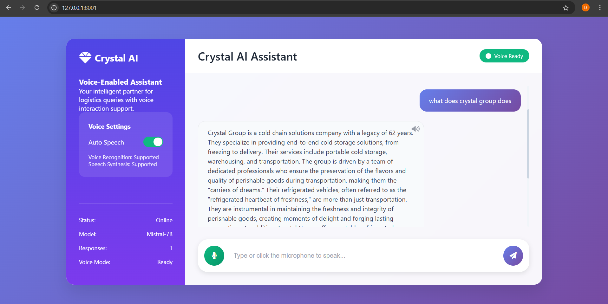
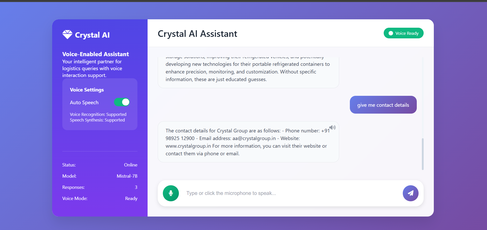
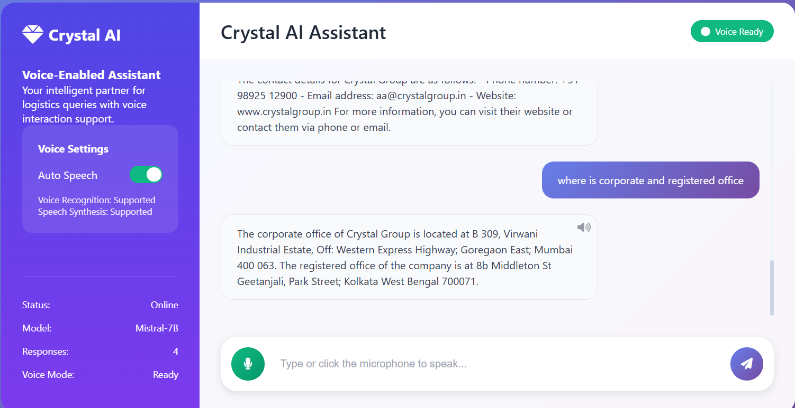

# Crystal Voice Assistant – AI Generalist Task Submission

This project is a submission for the AI Generalist role at **Crystal Group**. It showcases a voice-enabled AI assistant that can:

- 🎙️ Take **voice input** from the user
- 🧠 Use **GPT (Mistral 7B via OpenRouter)** to generate a response based on vectorized company information
- 🔊 Reply back with **voice output** using browser's TTS
- 📝 Log the full converasation in chat

---

## 📸 Demo Screenshot





---

## ✅ Features

- Voice-based **question-answering bot** for Crystal Logistics
- Built using **FastAPI**, **LangChain**, and **FAISS**
- Custom **vector database** built using OCR-extracted text from Crystal’s brochure
- Simple and responsive **HTML + CSS + JS frontend**
- Stores **chat history per session** in memory (can be easily modified to log in Airtable)

---

## 📁 Project Structure

```
Ask Crystal/
├── app.py                  # Terminal-based test interface
├── extract.py              # Extracts text from Crystal's brochure using OCR
├── ingest.py               # Converts text into FAISS vector database
├── main.py                 # FastAPI web backend for the assistant
├── requirements.txt        # All Python dependencies
├── .env                    # Contains OpenRouter API key
├── data/
│   ├── crystal_brochure.pdf
│   └── extracted_text.txt
├── faiss_crystal_index/    # Vector store built from extracted text
├── templates/
│   └── index.html          # Frontend UI with voice input/output
└── static/
    └── styles.css           # Basic frontend styling
```

---

## 🔧 Setup Instructions

### 1. Clone the repo & install dependencies

```bash
python -m venv venv &&  .\venv\Scripts\Activate.ps1
pip install -r requirements.txt
```

### 2. Add your OpenRouter API key

Create a `.env` file:

```
OPENROUTER_API_KEY=your_key_here
HF_MODEL_NAME=sentence-transformers/all-MiniLM-L6-v2
```

### 3. Extract and Ingest Text

```bash
python extract.py     # Extract brochure text using OCR
python ingest.py      # Convert text into FAISS vector DB
```

### 4. Run the App

```bash
uvicorn main:app --reload
```

Visit: [http://localhost:8000](http://localhost:8000)

---

## 🧪 Demo Flow

1. User clicks the 🎙️ button and speaks a query (e.g., "What services does Crystal offer?")
2. The query is sent to the FastAPI backend
3. The backend uses LangChain + FAISS to fetch relevant info from Crystal’s brochure
4. Response generated using Mistral-7B via OpenRouter
5. The bot replies via text **and** speech
6. The full session is logged in memory

---

## 🛠️ Tech Used

- **Backend**: FastAPI, LangChain, FAISS, Python
- **LLM**: Mistral-7B via OpenRouter API
- **Frontend**: HTML, CSS, JS, Web Speech API
- **OCR**: easyocr (for non-extractable brochure)

---

## 🗂️ Possible Improvements

- 🔁 WebSocket for real-time streaming answers
- 📝 Store logs in Google Sheets or Airtable
- 🎨 Improved responsive UI
- 🔐 User authentication and dashboard

---

Built with ❤️ for the Crystal Logistics AI Generalist Challenge.
